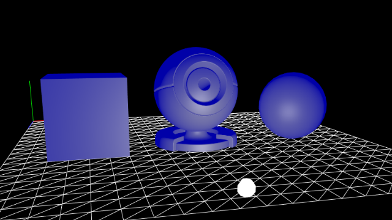
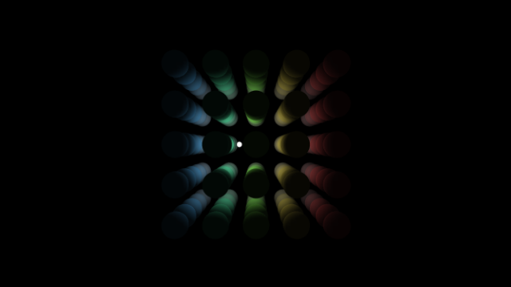
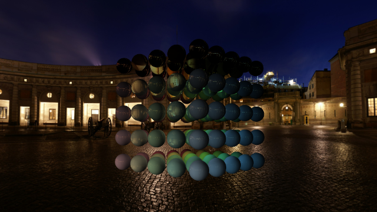
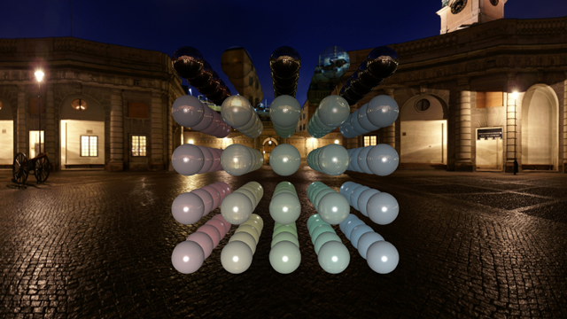

GitHub: [https://github.com/kenjiSpecial/tubugl-material-kyoshitsu](https://github.com/kenjiSpecial/tubugl-material-kyoshitsu)

### [#00 - Phong Material](./00/index.html)

### [#01 - Lamber Material](./01/index.html)

### [#02 - reflect and refract Lamber Material](./02/index.html)

### [#03 - reflect and refract Lamber Material](./03/index.html)

All examples were made with [tubugl](https://github.com/kenjiSpecial/tubugl)